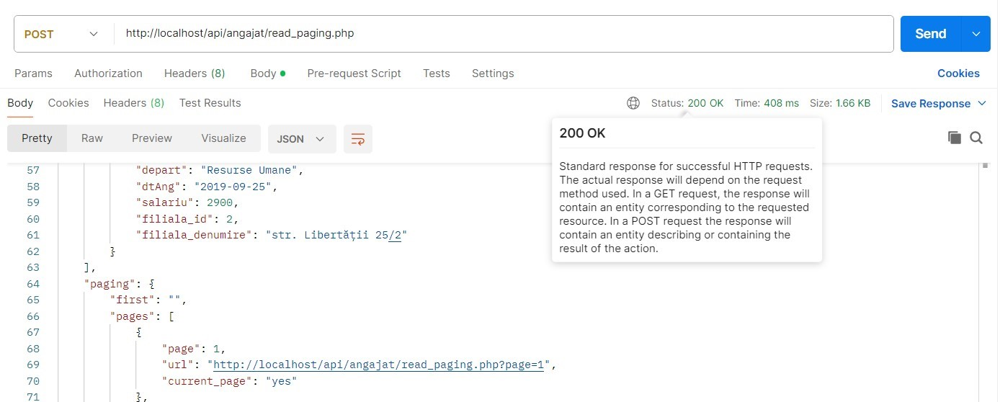

# Descrierea generală a proiectului
Implementarea unui sistem **CRUD** bazat pe **REST API** (**Representational State Transfer Application Programming Interface**) pentru metodele **GET/POST/PUT/DELETE** din **HTTP** standard pe server local **XAMPP** (**Apache**), cu implementarea unui search și a unei funcționalități de paginație. La fel am realizat implementarea măsurilor împotriva atacurilor de tip **cross-site scripting** (**XSS**) prin intermediul fucțiilor **PHP htmlspecialchars()** și **strip_tags()**.

Proiectul este bazat pe modelul client-server, adică utilizatorul trimite diferite **request**-uri și prin intermediul **http_response_code()** primește un cod HTTP de răspuns, care poate fi:
* 200 - OK;
* 201 - Created (utilizat împreună cu POST);
* 400 - Bad Request (posibil lipsesc parametrii necesari);
* 401 - Unauthorized (lipsesc parametrii de autentificare);
* 403 - Forbidden (autentificat, dar cu lipsă de privilegii necesare);
* 404 - Not Found, etc.

Server-ul (API-ul) răspunde utilizatorului cu un cod de rezultat și valid **JavaScript Object Notation** (**JSON**) returnând raw data prin intermediul **json_encode()** și **json_decode()**. La fel am utilizat extensia **PDO** (**PHP Data Objects**), ce reprezintă o interfață universală pentru accesul la diferite baze de date cu diferite dialecte ale limbajului **SQL**.

Am avut posibilitatea să utilizez diferite clauze în cadrul interogărilor SQL precum **SELECT**, **LEFT JOIN**, **ORDER BY (DESC)**, **INSERT INTO**, **WHERE**, **LIMIT**, **UPDATE SET**, **DELETE** și **LIKE** (pentru căutarea după keywords)

Deci mai întâi am creat baza de date (cu denumirea sugestivă autosalon_api) prin intermediul interfaței web **PhpMyAdmin**, și am făcut niște setări prealabile manuale. După aceasta am fost nevoit să execut interogări SQL de tip INSERT INTO VALUES pentru umplerea automată a celor 2 tabele create anterior cu date aleatorii formale, ca să nu pierd mult timp cu introducerea manuală:

# Testarea funcționalității (Postman)
În continuare sunt prezentate screenshot-uri cu testările interogărilor REST în programul special **Postman**, cu care am avut ocazia să lucrez un pic și în cadrul internship-ului în cadrul companiei Unifun.

